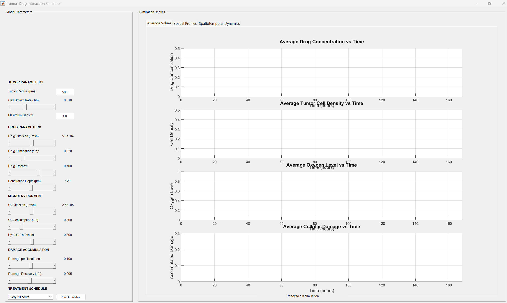

# Tumor-Drug Interaction Simulator

This project provides a MATLAB-based graphical user interface (GUI) for simulating tumor-drug interactions in a 1D spherical tumor model.

## GUI Preview

## Features
- Simulate drug diffusion, cell growth, oxygen consumption, and cellular damage.
- Adjustable parameters for tumor microenvironment, drug properties, and treatment schedule.
- Visualization of:
  - Average quantities over time
  - Spatial profiles at selected times
  - Spatiotemporal dynamics (heatmaps)

## How to Run
1. Open `code/advancedTumorGUI.m` in MATLAB.
2. Run the script.
3. Adjust parameters in the GUI and click "Run Simulation."

## Requirements
- MATLAB R2020b or later (GUI components use `uifigure`, `uitabgroup`, etc.)

## Results
Example screenshots are available in the `results/screenshots` folder.

## Author
Prashant Dhakal

## License
[MIT License](LICENSE)
